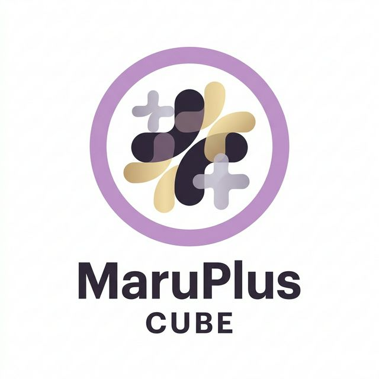

# MaruPlus Cube Logo Concept (マルプラスのサンジョウ ロゴコンセプト)

「マルプラスのサンジョウ」のミッションとビジョンに基づいた、柔軟で力強い共創を象徴するロゴコンセプトです。

## 1. デザインコンセプト：Flexible 3-Plus (＋ × 3)

「Sanjo（3乗）」の意味を、物理的な立方体（Cube）ではなく、**「3つのプラスの重なりによる相乗効果」**として表現しています。

- **マル（Maru）**: サイト全体の親和性と「和」を表現する円形のベース。
- **プラス（＋）× 3**: 3つの「＋」が重なり、お互いを支え合う躍動感を持たせています。
- **柔軟性（Flexibility）**: 鋭角を避けた角丸（Rounded caps）のプラスと、あえて少し角度をずらした配置により、変化に強いしなやかな組織を演出。

## 2. カラーパレット

サイトのデザイン（Tailwind CSS）に基づいた、高級感のある配色です。

- **Lilac (#D8BFD8)**: 知性と革新、サイトのメインテーマ。
- **Champagne Gold (#B2AC88)**: 成功と価値、高品質な支援。
- **Charcoal Purple (#544057)**: 信頼と安定性。

## 3. ビジュアルイメージ



## 4. SVG実装案（軽量・高精細）

直接HTML/PHPコードとして埋め込むことができるSVG版のコードです。

```svg
<svg width="200" height="200" viewBox="0 0 200 200" xmlns="http://www.w3.org/2000/svg">
  <defs>
    <linearGradient id="maruGrad" x1="0%" y1="0%" x2="100%" y2="100%">
      <stop offset="0%" stop-color="#FDFBFE" />
      <stop offset="100%" stop-color="#D8BFD8" />
    </linearGradient>
  </defs>
  
  <!-- Soft Maru Background -->
  <circle cx="100" cy="100" r="85" fill="url(#maruGrad)" stroke="#D8BFD8" stroke-width="0.5" />
  
  <!-- Three "Flexible" Plus signs -->
  <!-- Layer 1: Foundation -->
  <g opacity="0.4" transform="matrix(0.9, -0.2, 0.2, 0.9, 10, 5)">
    <path d="M100 65 V135 M65 100 H135" stroke="#A184A3" stroke-width="18" stroke-linecap="round" />
  </g>
  
  <!-- Layer 2: Action -->
  <g opacity="0.6" transform="matrix(0.95, 0.1, -0.1, 0.95, -5, -10)">
    <path d="M100 65 V135 M65 100 H135" stroke="#B2AC88" stroke-width="18" stroke-linecap="round" />
  </g>
  
  <!-- Layer 3: Result -->
  <g transform="matrix(1, 0, 0, 1, 0, 0)">
    <path d="M100 65 V135 M65 100 H135" stroke="#544057" stroke-width="20" stroke-linecap="round" />
    <path d="M100 65 V100 M65 100 H100" stroke="#FFFFFF" stroke-width="2" stroke-linecap="round" opacity="0.4" />
  </g>
</svg>
```

---
Created on: 2026-03-19
Company: 株式会社マルプラスのサンジョウ (MaruPlus Cube)
